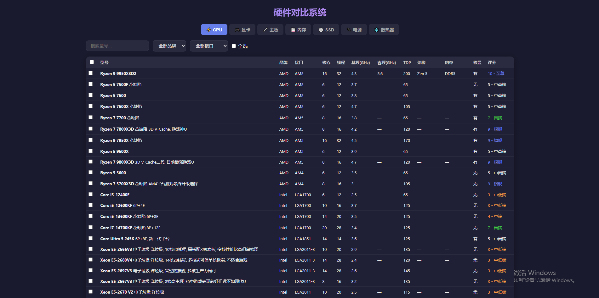
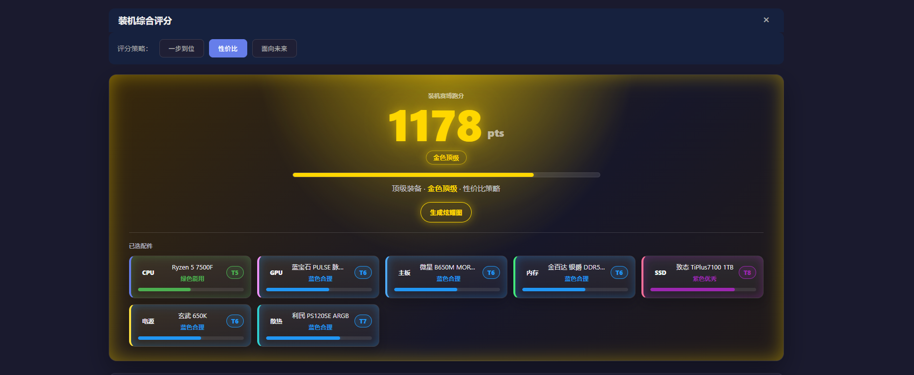
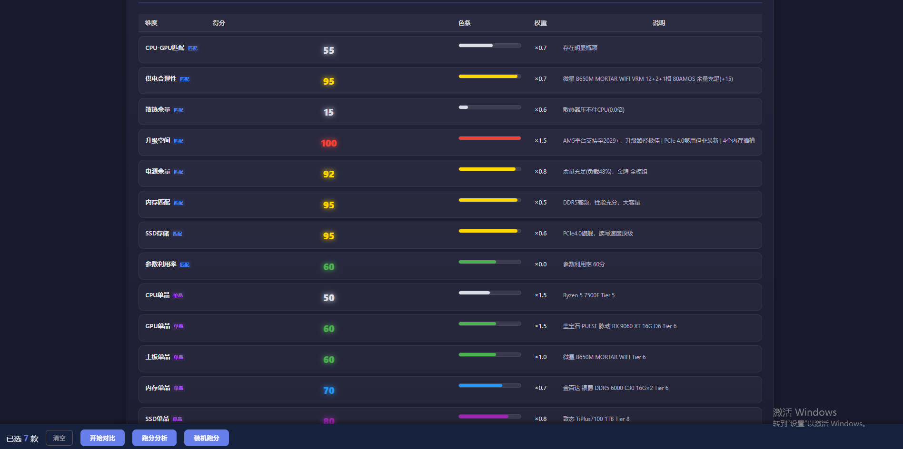

---
AIGC:
    Label: "1"
    ContentProducer: 001191440300708461136T1XGW3
    ProduceID: 1d901ace6510f3f7162dab4a93f6993e_ba778d6f71e911f1897e5254002afed2
    ReservedCode1: wqE2qWu4pgqyV1qifXHLo4OnvAuT2qbqYgx2I3F4j324elhlcW7zcCVNd/aUEvEX5lTYcHF8GZP+aw8wjqW6XC5OYRKx7qljDPokyP7oMjnTaSdt6vJ9j0yTBlU6+Y+CjWxZiD2LlrtZIbPkaBw2Jv8I9sclEHSkYLogXIXClLrHX10AloiE0N6iL+E=
    ContentPropagator: 001191440300708461136T1XGW3
    PropagateID: 1d901ace6510f3f7162dab4a93f6993e_ba778d6f71e911f1897e5254002afed2
    ReservedCode2: wqE2qWu4pgqyV1qifXHLo4OnvAuT2qbqYgx2I3F4j324elhlcW7zcCVNd/aUEvEX5lTYcHF8GZP+aw8wjqW6XC5OYRKx7qljDPokyP7oMjnTaSdt6vJ9j0yTBlU6+Y+CjWxZiD2LlrtZIbPkaBw2Jv8I9sclEHSkYLogXIXClLrHX10AloiE0N6iL+E=
---

# BuildAudit 硬件对比助手

> 装机不踩坑：本地硬件数据库 + 智能打分引擎，一站式看清每一分钱花得值不值。

## 这是什么

BuildAudit 是一个装机配置对比与评分工具，帮你在攒机时快速查参数、比性能、算分数。

**适合谁用**

- **装机小白**：快速看懂 CPU、显卡、主板、内存、硬盘、电源、散热是否匹配，避免被营销话术带偏。
- **硬件玩家**：通过整机跑分、等级颜色和结果图，获得更有展示感的配置评分。

## 界面截图

## 核心功能

- 多硬件搜索与选择（CPU / 显卡 / 主板 / 内存 / SSD / 电源 / 散热 / 机箱）
- 整机综合跑分 + 分项评分
- 性能、性价比、搭配合理性分析
- 兼容性风险提示（接口不匹配、功耗超标等）
- 洋垃圾 / 问题型号警告
- 七级颜色等级视觉系统（曜黑暗金 → 白色普通）
- 策略切换（性价比优先 / 性能优先 / 均衡型）

## 颜色分级

| 分值 | 颜色 | 含义 |
|------|------|------|
| 1425+ | 曜黑暗金 | 至高无上 |
| 1275-1424 | 红色 | 极致拉满 |
| 1125-1274 | 金色 | 顶级 |
| 975-1124 | 紫色 | 优秀 |
| 825-974 | 蓝色 | 合理 |
| 600-824 | 绿色 | 能用 |
| 0-599 | 白色 | 不推荐 |

## 评分方向

当前评分综合考虑：

- 单个硬件性能（CPU / GPU 独立跑分）
- 不同硬件之间的搭配关系
- 价格与性价比
- 平台定位与代际差异
- 新手装机风险（散热不足、电源余量过低等）
- 整机配置均衡度

评分系统仍在持续调整，后续会继续优化权重和兼容性规则。

## 数据规模

| 模块 | 条目数 |
|------|--------|
| CPU | 138 |
| GPU | 3,116 |
| 主板 | 3,109 |
| 内存 | 2,463 |
| SSD | 424 |
| 电源 | 256 |
| 散热 | 304 |
| 机箱 | 113 |
| **合计** | **9,923** |

## 怎么打开

不需要安装任何软件，有浏览器就能用：

1. 下载本项目到本地
2. 双击 `index.html`，用浏览器打开
3. 开始搜索和对比

> 如果使用 Python 搜索引擎：`python engine/search.py`（需 Python 3.8+）

## 主要文件

| 文件 | 说明 |
|------|------|
| `index.html` | 主界面，双击打开即用 |
| `app.js` | 前端逻辑：搜索 / 筛选 / 对比 / 评分渲染 |
| `data.js` | 硬件数据库（RAW_DATA） |

## 项目状态

当前为早期原型版本，可以完整运行，但硬件数据库、评分权重和兼容性判断仍在持续完善。

后续方向：
- 扩充真实硬件型号数据库
- 增强主板、显卡、散热、电源之间的兼容判断
- 优化整机评分权重
- 改进适合分享的装机跑分结果图
- 增加更清晰的新手提示

## 贡献

欢迎提 Issue 和 PR。数据更新、BUG 修复、新功能建议都可以。

评分结果仅作参考，不应替代真实评测和官方规格。

## 许可证

MIT License — 详见 [LICENSE](LICENSE) 文件。
*（内容由AI生成，仅供参考）*
